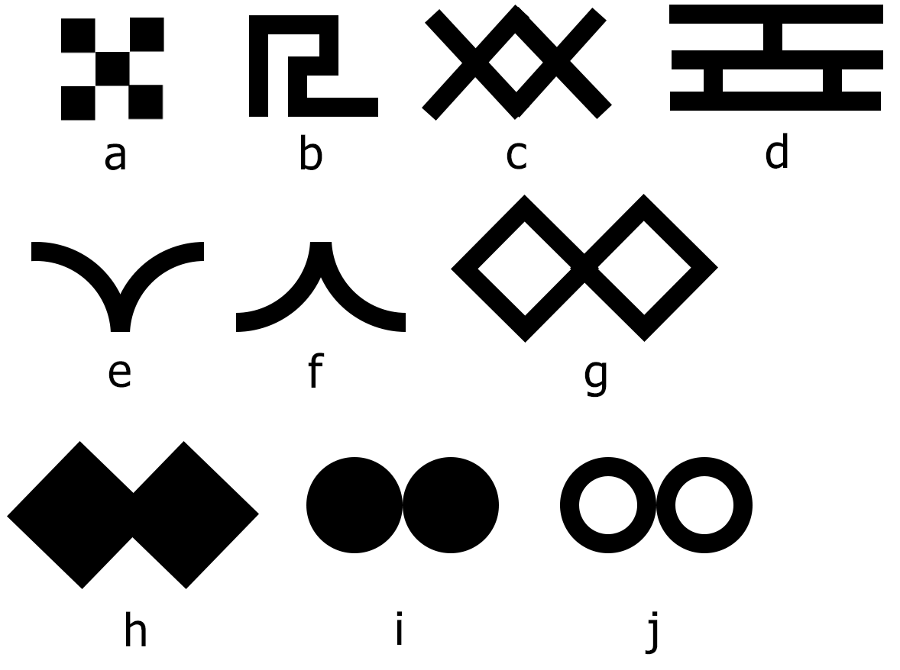

# Lab-1
## Лабораторная работа №1

**Задание**

* Сгенерировать при помощи escape-символов в консоли изображение флага, соответственно варианту (столбец "Страна").
* Сгенерировать в консоли повторяющийся узор (столбец "Узор").
* Сгенерировать в консоли график функции (1 четверти) при помощи escape-символов, минимум 9 строк в высоту (столбец "Функция").
* Используя прилагаемый файл с числовой последовательностью ```sequence.txt```, вывести диаграмму процентного соотношения согласно варианту.

**Допзадание**

Используя функцию очищения консольного вывода (```os.system("cls")``` или ```os.system("clear")```), реализовать анимацию из 2-3 кадров.

**Варианты**

| Вариант | Страна | Узор | Функция | Условие |
| ------- | ------ | ---- | ------- | ------- |
| 1 | Франция | a | y=x^2 | Количество чисел меньше и больше 0 |
| 2 | Бангладеш | b | y=2x+3 | Сумма по модулю первых 125 чисел и вторых 125 чисел |
| 3 | Нидерланды | c | y=2x | Сумма чисел по модулю, стоящих на чётных и нечётных позициях |
| 4 | Польша | d | y=x^0.5 | Среднее по модулю первых 125 и вторых 125 чисел |
| 5 | Литва | e | y=\|x\| | Среднее по модулю чисел, стоящих на чётных и нечётных позициях |
| 6 | Таиланд | f | y = 1 / x | Числа больше 5 и меньше 5, отрицательные отбросить |
| 7 | Япония | g | y = 3x | Числа больше -5 и меньше -5, положительные отбросить |
| 8 | Бенин | h | y = x + 1 | Числа от 0 до 5 и числа от 0 до -5, остальные отбросить |
| 9 | Финляндия | i | y = x / 2 | Числа от 5 до 10 и числа от -5 до -10, остальные отбросить |
| 10 | Швейцария | j | y = x / 3 | Числа от -3 до 3 и остальные |

**Узоры**

<p align="center">
  
</p>

**Ссылки**

Флаги разных стран: https://www.worldometers.info/geography/flags-of-the-world/  
Об escape-последовательностях: https://docs-python.ru/tutorial/strokovye-bajtovye-literaly/escape-posledovatelnosti-python/  
И ещё: https://dvmn.org/encyclopedia/python_strings/ansi-codes/  
Примеры: https://www.lihaoyi.com/post/BuildyourownCommandLinewithANSIescapecodes.html
